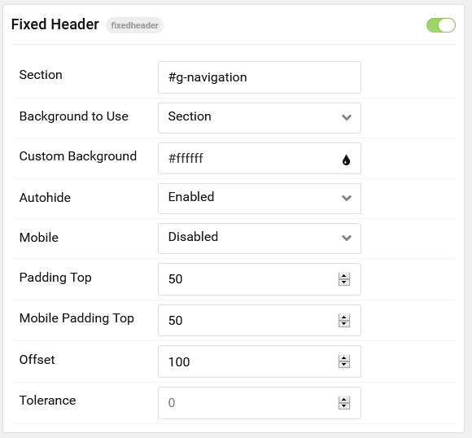

## Introduction

The **Fixed Header** atom gives you the ability to fix your header to the top of your page so it follows your visitors as they scroll.

The fixed header conveniently disappears as the user scrolls down and slides down with the slightest upward scroll. This allows users to see the full scope of the page while maintaining access navigation and search without having to scroll back to the top.

## Setup

To set up the atom, simply navigate to the **Page Settings** tab in the outline you wish to apply full page scrolling to and drag-and-drop the **Fixed Header** atom into the white **Atoms** bar. This will activate the atom for the outline.

Next, you can access the atom's settings by selecting the cogwheel icon.

| Setting            | Description                                                          |
| :-----             | :-----                                                               |
| Section            | Define the ID or class of the section that you want to set as fixed. |
| Background to Use  | Choose between the section's color and a custom color.               |
| Custom Background  | Choose a custom background color for the fixed header.               |
| Autohide           | Choose if the fixed header autohides on scroll or stays visible.     |
| Mobile             | **Enable** or **Disable** fixed header for mobile devices.           |
| Padding Top        | Set the top padding for the particle.                                |
| Mobile Padding Top | Set the top padding for the particle as it appear on mobile devices. |
| Offset             | Vertical offset in pixels before the element is unpinned.            |
| Tolerance          | Scroll tolerance in pixels before the state changes.                 |