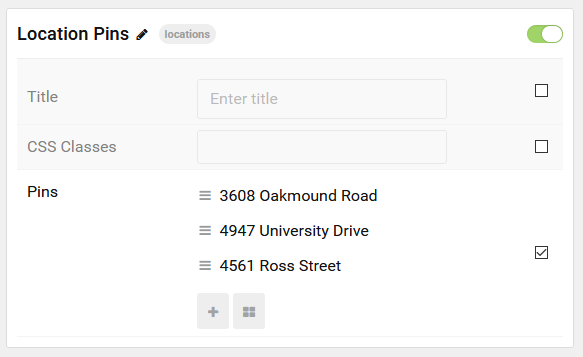
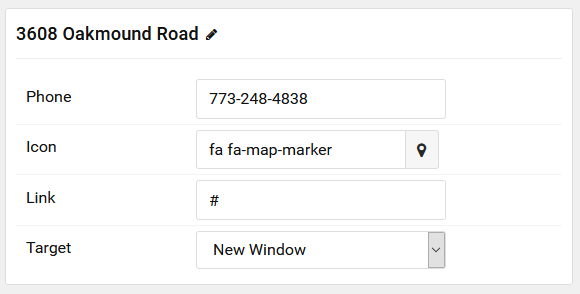

## Introduction

The **Location Pins** particle brings attention to the location(s) of your business. It's a clean and easy way to feature address(es) where customers can go to visit your storefront.

Here are the topics covered in this guide:

- [Introduction](#introduction)
- [Configuration](#configuration)
  - [Main Options](#main-options)
  - [Item Options](#item-options)

## Configuration

### Main Options 

These options affect the main area of the particle, and not the individual items within. You can set the title of the particle, as well as give it an introductory paragraph here.

| Option      | Description                                                                     |
| :---------- | :------------------------------------------------------------------------------ |
| Title       | Enter the title of the particle you would like to have appear on the front end. |
| CSS Classes | Set the CSS class(es) you would like to have apply at the particle level.       |

### Item Options

These items make up the individual featured items in the particle. They are sorted into categories using the first level of cards. The name of the level (in our demo we used `Particles` and `Features`) appears on the front end as tabs which the user can select to load the cards that appear within the category.

| Option | Description                                                                                                                                   |
| :----- | :-------------------------------------------------------------------------------------------------------------------------------------------- |
| Name   | The name of the item as it should appear on the front end. Ideally, this would be the address of the business. Example: `3608 Oakmound Road`. |
| Phone  | Add a phone number for your busines. Example: `773-248-4838`                                                                                  |
| Icon   | Select an icon to appear with the address and phone number.                                                                                   |
| Link   | Add a URL that selecting the item will send the visitor to.                                                                                   |
| Target | Select the target through which the URL will open.                                                                                            |

