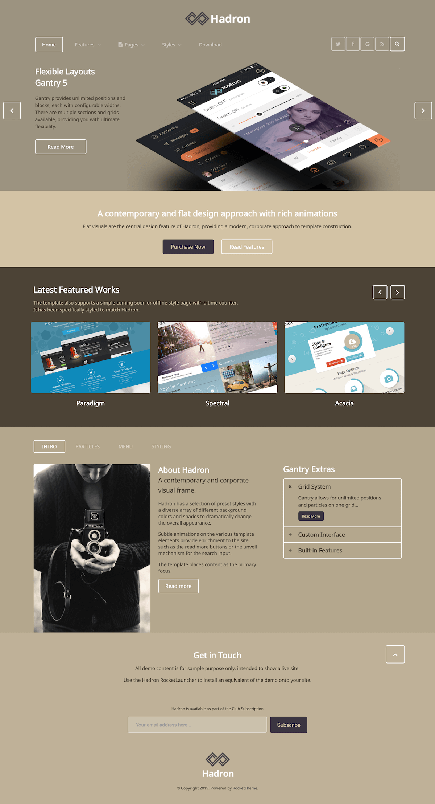

Introduction
-----

Recreating features of the demo site used to show off some of the more interesting aspects of Hadron can be done fairly easily. All you need is the right particles and settings, and you should be able to reproduce most (if not all) of the elements found in our demo site.

Below, we will break down some of these elements and give you the information you need to know to recreate them on your own site using the Hadron Theme.

Keep in mind that a lot of the detail that makes our demos look so good is the result of many hours of hard work by our team, and some of them will require a moderate level of experience working with the WordPress back end. We have added most of these elements into the theme's core files in order to make them easily accessible without having to edit any code.

>> NOTE: We recommend downloading a copy of the RocketLauncher whenever you are attempting to replicate demo content. This allows easy referencing, whether on your site in a subdirectory, development server, or on a localhost. This will allow you to see all of our demo content in context, making it easier to replicate.

Home Particles
-----

Below, you will find the particle placement and settings for the various positions as they appear on the front page of our demo. Not all of these position assignments are unique to the front page.

:   1. **Navigation** Logo (Particle) [2%, 40%, se]
    2. **Navigation** Menu (Particle) [6%, 5%, se]
    3. **Navigation** Social (Particle) [6%, 74%, se]
    4. **Navigation** Search (Particle) [6%, 97%, se]
    5. **Showcase** Slider (Particle) [10%, 35%, se]
    6. **Utility** Custom HTML (Particle) [25%, 50%, se]    
    7. **Feature** Custom HTML (Particle) [36%, 5% se]
    8. **Feature** Strips Slider (Particle) [39%, 97% se]
    9. **Maintop** Content Tabs (Particle) [56%, 5%, se]
    10. **Maintop** Lists (Particle) [57%, 66%, se]
    11. **Bottom** Custom HTML (Particle) [80%, 50%, se]
    12. **Bottom** To Top (Particle) [80%, 90%, se]
    13. **Bottom** MailChimp (Particle) [87%, 50%, se]
    14. **Copyright** Branding (Particle) [93%, 50%, se]
    15. **Copyright** Copyright (Particle) [100%, 50%, se]

Not pictured here is an **Offcanvas** position which hosts the mobile menu. You can find out more about the Offcanvas position in the [Gantry 5 documentation](http://docs.gantry.org/gantry5/configure/layout-manager#offcanvas-section).

Particles
-----

Here is a list of particles that are available in Hadron, as well as links to documentation to help you get started:

>> All Home Particles can be edited via Themes > Hadron - Home > Layout.

* Theme Particles
    * [Slider](particle_slider.md)
    * [Strips Slider](particle_stripsslider.md)
    * [Content Tabs](particle_contenttabs.md)
    * [Lists](particle_lists.md)
    * [MailChimp](particle_mailchimp.md)
    * [Audio Player](particle_audio.md)
    * [Block Content](particle_block.md)
    * [Calendar](particle_calendar.md)
    * [Contact](particle_contact.md)
    * [Content List](particle_contentlist.md)
    * [WordPress Posts](particle_wordpress.md)
    * [Info List](particle_info.md)
    * [Headlines](particle_headlines.md)
    * [Mosaic](particle_mosaic.md)
    * [Image Grid](particle_image.md)
    * [Progress Bar](particle_progressbar.md)
    * [Testimonial](particle_testimonial.md)
    * [Tab Image](particle_tabimage.md)
    * [Vertical Menu](particle_verticalmenu.md)
    * [Pricing Table](particle_pricing.md)
    * [Promo Image](particle_promoimage.md)
    * [Simple Counter](particle_simplecounter.md)
    * [Video](particle_video.md)
    * [Swiper](particle_swiper.md)
* Core Particles
    - [Logo](http://docs.gantry.org/gantry5/particles/logo)
    - [Menu](http://docs.gantry.org/gantry5/particles/menu-control)
    - [To Top](http://docs.gantry.org/gantry5/particles/to-top)
    - [Social](http://docs.gantry.org/gantry5/particles/social)
    - [Positions](http://docs.gantry.org/gantry5/particles/position)
    - [Spacer](http://docs.gantry.org/gantry5/particles/spacer)
    - [Mobile Menu](http://docs.gantry.org/gantry5/particles/mobile-menu)
    - [Custom HTML](http://docs.gantry.org/gantry5/particles/custom-html)
    - [Page Content](http://docs.gantry.org/gantry5/particles/page-content)
    - [System Messages](http://docs.gantry.org/gantry5/particles/system-messages)

    Recommended Plugins
    -----

    Here is a list of RocketTheme plugins used to create the demo version of Hadron:

    * [Gantry 5 Theme Framework](http://gantry.org/)

    Many of these plugins are included with the Hadron RocketLauncher, and can be downloaded and installed individually by going to the RocketTheme website.

    Recreating the Front Page
    -----

    The front page of the Hadron demo sits apart from the rest of the page layouts in that it features the latest and greatest features of the theme. It is because of this that several module and layout overrides were done. In this section, we will break down the settings you will need to recreate elements present in the front page of the Hadron demo.

    Home Page Layout Presets
    -----

    

    While the **Home - Particles** layout is automatically loaded after installing the Hadron theme, we have included a layout preset for the home page within the theme if needed. The **Home - Particles** preset includes all of the particle-based home page demo content so you can hit the ground running with a copy of our demo to work from loaded directly into the layout.

    You can access the presets by selecting **Load** in the **Layout Manager**.

    Menu Editor
    -----

    

    Hadron has its own built-in Menu Editor which takes full advantage of WordPress's menu system, taking your WordPress menus and enhancing them before passing them to visitors on the front end. Any changes made in the Menu Editor will only affect the way it appears to the visitor, and not the way WordPress sees or uses it.

    You can access the Gantry Menu Editor by navigating to **Admin > Hadron Theme > Menu**. You can find out more about navigating and using the Gantry Menu Editor [in our documentation](http://docs.gantry.org/gantry5/configure/menu-editor).

    Assignments
    -----

    

    Assignments are also managed in the Gantry Administrator. This administrative panel enables you to assign theme outlines to specific menu items, pages, and other areas of your site. By navigating to **Admin > Hadron Theme** and selecting an outline other than the **Base Outline**, you will be able to assign that outline by navigating to the **Assignments** panel. Simply switch any menu items to on (green) that you want to assign that outline to. In the case of the Home page, this would be your default Home page in your default (main) menu.
